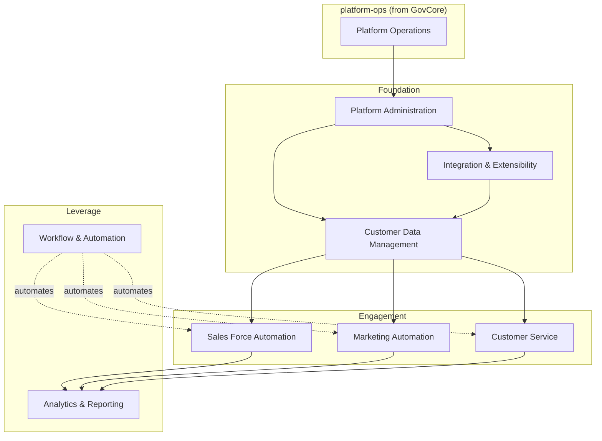

# GovCRM Capabilities

**Validation Status: [UNVERIFIED] Assumed** — the capability set below was imported from the easyea-crm-baseline prototype (synthesized from vendor market research) plus a GovCore-sourced platform-ops module; nothing has been validated with a real stakeholder yet.

This document summarizes GovCRM's capability map. Definitions in [`business-architecture/capabilities/`](./business-architecture/capabilities/) are authoritative; this summarizes them. Two modules, two provenances:

- **`crm/`** — market-derived (present in ≥5 of 7 surveyed platforms; evidence: [vendor matrix](./business-architecture/capabilities/crm-vendor-reference.md), method: [market scan](./docs/research/crm-market-scan.md))
- **`platform-ops/`** — GovCore-derived (the multi-tenant operator plane GovCRM consumes from `@govcore/*`; rationale: [fit/gap analysis](./docs/design/govcore-fit-gap.md))

## Capability Map

## Capability Groups

| # | Group | Module | Prefix | Sub-caps | Status |
|---|---|---|---|---|---|
| 0 | [Platform Operations](./business-architecture/capabilities/platform-ops/platform-operations/platform-operations.md) | platform-ops | `po` | 4 | Consumed from `@govcore/*`; scaffold wires tenancy/auth/RBAC/audit/console |
| 1 | [Customer Data Management](./business-architecture/capabilities/crm/customer-data-management/customer-data-management.md) | crm | `cdm` | 6 | First slice scaffolded (contact type on the content engine); rest planned |
| 2 | [Sales Force Automation](./business-architecture/capabilities/crm/sales-force-automation/sales-force-automation.md) | crm | `sfa` | 6 | Planned |
| 3 | [Marketing Automation](./business-architecture/capabilities/crm/marketing-automation/marketing-automation.md) | crm | `ma` | 4 | Planned |
| 4 | [Customer Service](./business-architecture/capabilities/crm/customer-service/customer-service.md) | crm | `cs` | 5 | Planned |
| 5 | [Analytics & Reporting](./business-architecture/capabilities/crm/analytics-reporting/analytics-reporting.md) | crm | `ar` | 4 | Planned |
| 6 | [Workflow & Automation](./business-architecture/capabilities/crm/workflow-automation/workflow-automation.md) | crm | `wa` | 4 | Planned |
| 7 | [Platform Administration](./business-architecture/capabilities/crm/platform-administration/platform-administration.md) | crm | `pa` | 5 | Partially provided by GovCore — see the [fit/gap build list](./docs/design/govcore-fit-gap.md) |
| 8 | [Integration & Extensibility](./business-architecture/capabilities/crm/integration-extensibility/integration-extensibility.md) | crm | `ix` | 6 | Planned; `ix-api-webhooks` is an entire build (no GovCore surface) |

**Total: 9 groups, 44 sub-capabilities.** Per-sub-capability descriptions and vendor evidence live in the group parents and the [baseline index](./business-architecture/capabilities/crm-vendor-reference.md).

## Personas

Ten imported personas in [`business-architecture/personas/`](./business-architecture/personas/) (sales-rep, sales-manager, account-manager, marketing-manager, support-agent, support-manager, crm-administrator, sales-operations-analyst, executive-sponsor, customer) — all **[UNVERIFIED] Assumed**. An **Instance Operator** persona is required by the platform-ops module and not yet written. Stakeholder validation is the gate before implementation priorities harden.
